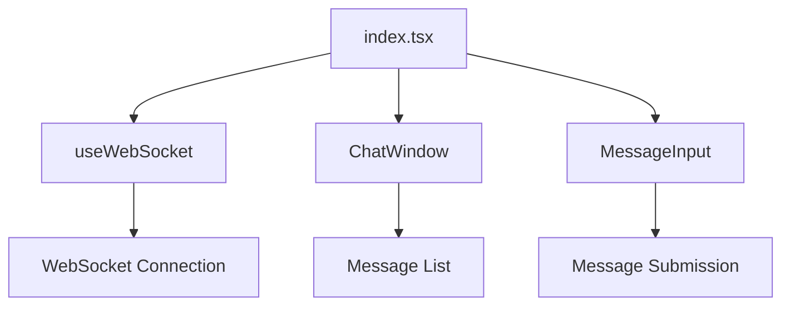

# Real-Time Chat Interface Architecture

## Overview
WebSocket-based chat interface using Next.js (TypeScript) with the following features:
- Real-time message exchange via `wss://echo.websocket.org`
- Mobile-responsive UI with Tailwind CSS
- Type-safe components and hooks

## Component Structure


## File Structure
```
/
├── components/
│   ├── ChatWindow.tsx    # Message display component
│   └── MessageInput.tsx  # Input field with send button
├── hooks/
│   └── useWebSocket.ts   # WebSocket connection manager
├── pages/
│   └── index.tsx         # Main page layout
└── types/
    └── chat.d.ts         # Type definitions
```

## Technical Decisions
1. **WebSocket Management**
   - Native WebSocket API with auto-reconnect
   - Connection status tracking (connecting/connected/error)
   - Message buffering during disconnections

2. **Type Safety**
   ```ts
   interface Message {
     id: string
     content: string
     timestamp: number
     origin: 'user' | 'server'
   }
   ```

3. **Performance**
   - Virtualized message list for large histories
   - useEffect cleanup for WebSocket connections
   - useRef for persistent connection reference

4. **Responsive Design**
   - Mobile-first approach with breakpoints:
     - sm: 640px (mobile)
     - md: 768px (tablet)
     - lg: 1024px (desktop)

## Testing Strategy
1. **Unit Tests**
   - Message serialization/deserialization
   - Connection state transitions

2. **E2E Tests**
   - Message send/receive flow
   - Connection failure recovery
   - Cross-browser compatibility

## Pending Implementation Tasks
- [ ] Create TypeScript definition file
- [ ] Implement useWebSocket hook
- [ ] Build ChatWindow component
- [ ] Develop MessageInput component
- [ ] Set up Tailwind configuration